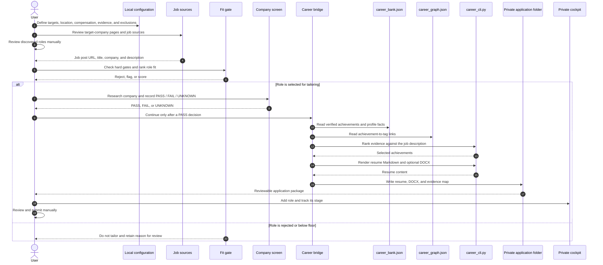

# Career Bank Job-Search Flow

This is the local-first path from search configuration to a selected role's
tailored resume. Your `career_bank.json` remains the verified-evidence source;
the fork reads it in place and does not copy it into this repository.



## What is automated today

- Evidence selection from `career_bank.json`, with `career_graph.json` tags in
  the evidence map.
- Tailored Markdown resume and optional DOCX generation for a chosen role.
- Local pipeline tracking in the cockpit.

## What remains deliberately human-run

- Finding and opening job posts. The `scout` files are source and company
  inventories; this fork does not yet poll job boards automatically.
- Company research and the final PASS / FAIL / UNKNOWN decision.
- Reviewing the evidence map, editing the resume if needed, and submitting an
  application.

## Run a selected role

Keep the role JSON, job description, and output folder private. Then run:

```bash
/Volumes/T9/code/career/.venv/bin/python tailor/tailor.py \
  --career-cli /Volumes/T9/code/career/career_cli.py \
  --career-bank /Volumes/T9/code/career/career_bank.json \
  --career-graph /Volumes/T9/code/career/career_graph.json \
  --role private/roles/example-company-ai-platform.json \
  --out private/output/example-company-ai-platform \
  --docx
```
